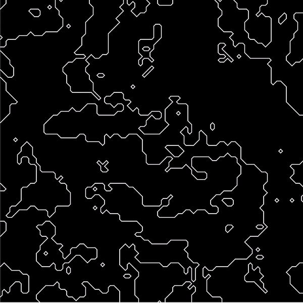
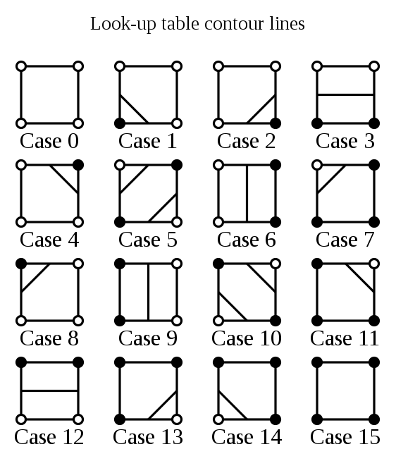

# Marching Squares

### Visualization of the marching squares algorithm

Made with JavaScript and visualized with the p5.js library

 

Applications for this project:

-   can be modified for procedural cave generation

 

This visualization is created with an underlying 3D perlin noise field of values between 0 and 1. Then contours are drawn based on values in the grid.

A field may look like:  

Contours are drawn according the following chart:  

Source: 
https://en.wikipedia.org/wiki/Marching_squares  
https://www.youtube.com/watch?v=0ZONMNUKTfU
